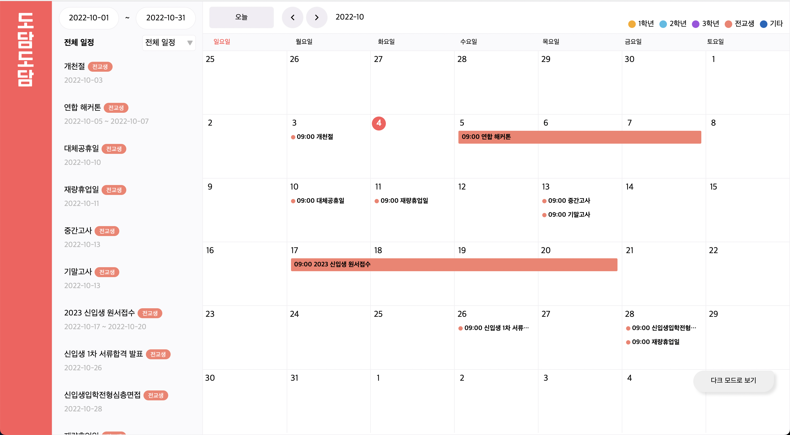

  

<h4 align="center">학생들을 위한, 학생들이 만든, 스마트스쿨 플랫폼</h4>

# [도담도담](https://dodam.b1nd.com/) 이란?

도담도담은 모든 학생과 모든 선생님에게 사고없이 편리함을 제공해줄 수 있는 스마트스쿨 플랫폼으로, 교내 전교생과 모든 선생님들이 사용하고 있어요.

> 아쉽지만 해당 서비스는 대소고학생 들만 사용할 수 있어요 🥲

# 도담도담 일정페이지에서 하는일은?

- 도담도담 일정페이지에서는 대구소프트웨어마이스터고등학교의 1년 학사일정을 제공해줘요!
- 학사일정은 도담 티쳐에서 선생님들이 추가해주시고 있어요!

더욱 상세한 기능은 아래와 같아요!

## 기능 리스트

- 학사 일정 조회 기능
  - 월별로 존재하는 학사일정들을 내 일정과 전체 일정별로 조회 할 수 있습니다.

# 일정페이지 화면

> 위 사진은 일정페이지 화면이에요. 학사일정을 월별로 캘린더 형식으로 보여줘요. 위쪽 화살표 버튼을 통해 다른 달의 학사일정을 볼 수 있어요.

# 기술 스택

`Typescript`, `React`, `Recoil`, `React-Query`, `Styled-Components`, `Axios`, `Tui Calendar`
